# AWS Serverless CloudOps Event Pipeline

This repository contains a **fully working serverless, event-driven pipeline on AWS**, implemented using **CloudFormation**.
The project demonstrates a real CloudOps-style architecture where data flows asynchronously through managed AWS services.

---

## Architecture


**Event Flow:**

1. A log file is uploaded to an S3 input bucket  
2. S3 sends an event notification to an SQS queue  
3. A Lambda function consumes messages from SQS  
4. Lambda processes the data and writes results to DynamoDB  
5. Failed messages are routed to a Dead Letter Queue (DLQ)  
6. Logs are available in CloudWatch  

---

## AWS Services Used

- Amazon S3  
- Amazon SQS (Main Queue + DLQ)  
- AWS Lambda  
- Amazon DynamoDB  
- Amazon CloudWatch  
- AWS CloudFormation  

---

## Project Structure

```
.
├── architecture/
│   └── diagram.png
├── cloudformation/
│   ├── main.yaml
│   ├── s3.yaml
│   ├── sqs.yaml
│   ├── lambda.yaml
│   └── dynamodb.yaml
├── lambda/
│   └── processor.py
├── sample-data/
│   ├── test-log.json
│   ├── test-log.txt
│   └── dlq-test.txt
├── scripts/
│   ├── package.sh
│   ├── deploy.sh
│   └── delete.sh
├── screenshots/
│   └── (see below)
└── README.md
```

---

## Deployment

### 1. Package CloudFormation templates

```bash
./scripts/package.sh
```

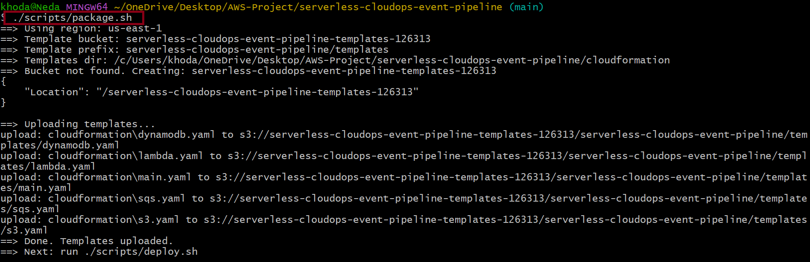

---

### 2. Deploy the stack

```bash
./scripts/deploy.sh
```

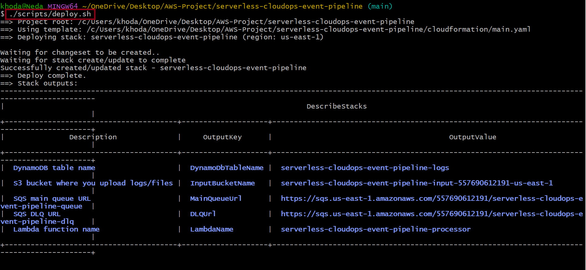

---

## CloudFormation

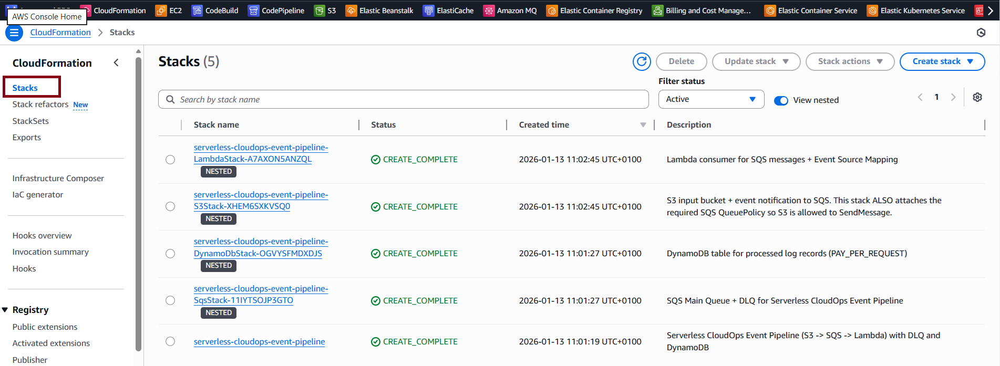

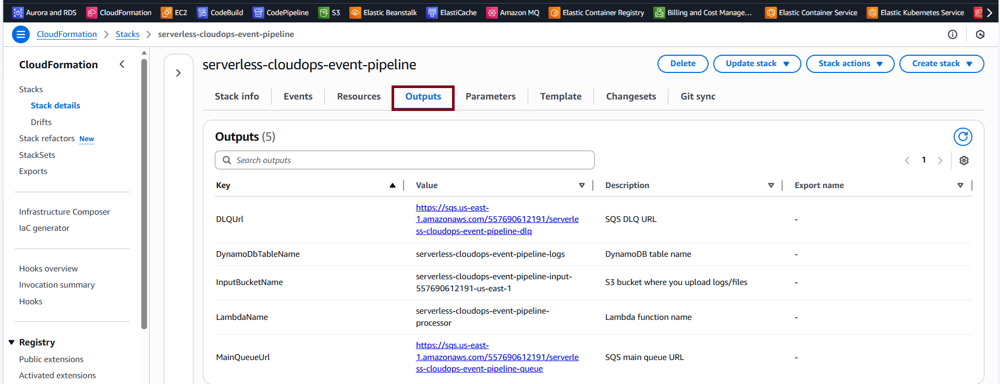

---

## S3 Input Bucket

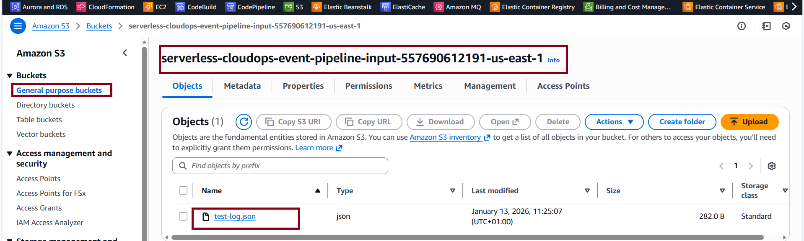

---

## SQS

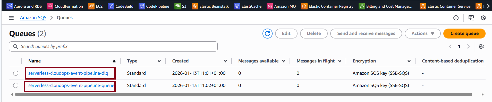

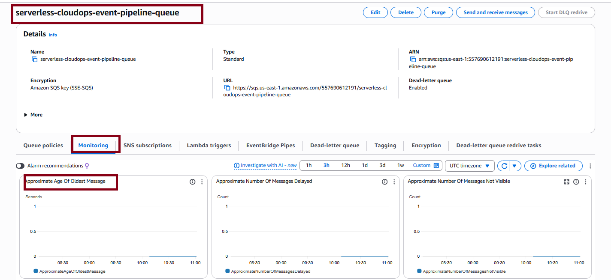

---

## Lambda

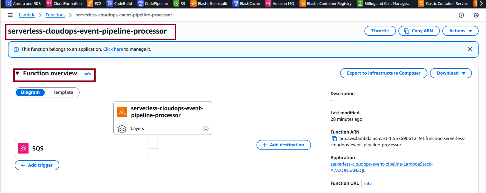

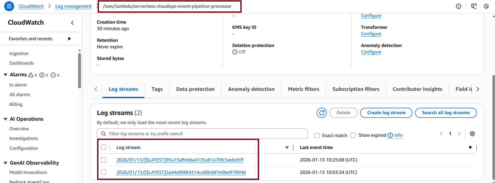

---

## DynamoDB

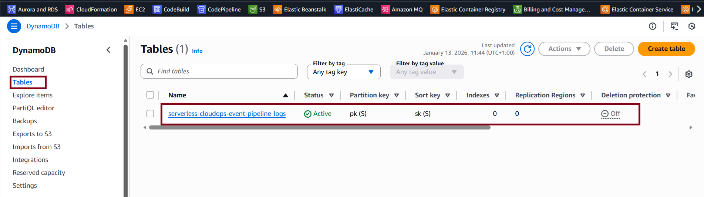

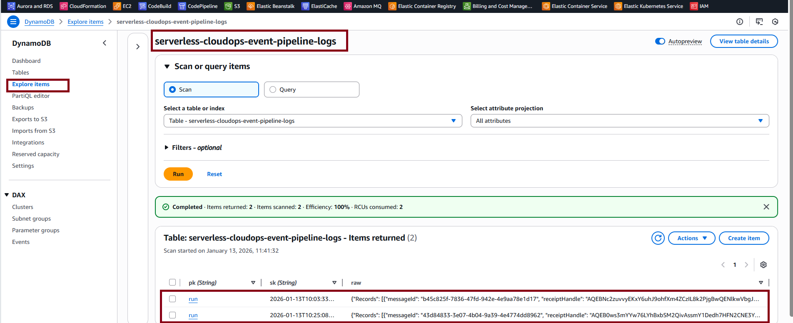

---

## Testing

Upload this file to S3:

```
sample-data/test-log.json
```

To test DLQ:

```
sample-data/dlq-test.txt
```

---

## Cleanup

```bash
./scripts/delete.sh
```


